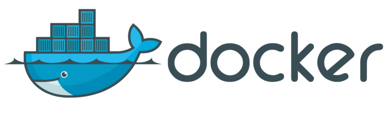

# Docker 入门

## **什么是Docker？**

    Docker 最初是 dotCloud 公司创始人 Solomon Hykes 在法国期间发起的一个公司内部项目，它是基于 dotCloud 公司多年云服务技术的一次革新，并于 2013 年 3 月以 Apache 2.0 授权协议开源，主要项目代码在 GitHub 上进行维护。Docker 项目后来还加入了 Linux 基金会，并成立推动 开放容器联盟（OCI）。
        Docker 在容器的基础上，进行了进一步的封装，从文件系统、网络互联到进程隔离等等，极大的简化了容器的创建和维护。使得 Docker 技术比虚拟机技术更为轻便、快捷。


## **为什么要用Docker**
```
作为一种新兴的虚拟化方式，Docker 跟传统的虚拟化方式相比具有众多的优势。
```
- **更高效的利用系统资源**
- **更快速的启动时间**
- **一致的运行环境**
- **持续交付和部署**
- **更轻松的迁移**
- **更轻松的维护和扩展**
- **对比传统虚拟机总结** <br> 
 
    |**特性**|**容器**|**虚拟机**|
    |:-|:-|:-|
    |启动|秒级|分钟级|
    |硬盘使用|一般为`MB`|一般为`GB`|
    |性能|接近原生|弱于|
    |系统支持量|单机支持上千个容器|一般几十个|  


## **基本概念**
1. **镜像 `(Image)`**
   1. Docker镜像相当于是一个 `root` 文件系统，除了提供容器运行时所需要的程序，库，资源，配置等文件外，还包含了一些为运行时准备的一些配置参数。
   2. `分层存储`：
      1. 在 Docker 设计时，就充分利用 `Union FS` 的技术，将其设计为分层存储的架构。镜像并非是像一个 `ISO` 那样的打包文件，镜像只是一个虚拟的概念，其实际体现并非由一个文件组成，而是由一组文件系统组成，或者说，由多层文件系统联合组成。
      2. 镜像构建时，会一层层构建，前一层是后一层的基础。每一层构建完就不会再发生改变，后一层上的任何改变只发生在自己这一层。
2. **容器 `(Container)`**
   1. `镜像（Image）`和`容器（Container）`的关系，就像是面向对象程序设计中的 类 和 实例 一样，镜像是静态的定义，容器是镜像运行时的`实体`。容器可以被创建、启动、停止、删除、暂停等。
   2. 容器的实质是进程，但与直接在宿主执行的进程不同，容器进程运行于属于自己的独立的 `命名空间`。因此容器可以拥有自己的 root 文件系统、自己的网络配置、自己的进程空间，甚至自己的用户 ID 空间。容器内的进程是运行在一个`隔离`的环境里，使用起来，就好像是在一个独立于宿主的系统下操作一样。
3. **仓库 `(Repository)`**
   1. 镜像构建完成后，可以很容易的在当前宿主机上运行，但是，如果需要在其它服务器上使用这个镜像，我们就需要一个集中的存储、分发镜像的服务，`Docker Registry` 就是这样的服务。
   2. 一个` Docker Registry `中可以包含多个`仓库`（Repository）；每个仓库可以包含多个`标签`（Tag）；每个标签对应一个镜像。
   3. 通常，一个仓库会包含同一个软件不同版本的镜像，而标签就常用于对应该软件的各个版本。我们可以通过 `<仓库名>:<标签> `的格式来指定具体是这个软件哪个版本的镜像。如果不给出标签，将以` latest` 作为默认标签。
   4. 仓库名经常以 `两段式路径` 形式出现，比如 `jwilder/nginx-proxy`，前者往往意味着 Docker Registry 多用户环境下的用户名，后者则往往是对应的软件名。但这并非绝对，取决于所使用的具体 Docker Registry 的软件或服务。

## **本地运行服务：**
1. 运行ubuntu:  
   1. 获取ubuntu镜像，并进入 `ubuntu bash`
        ```
        docker run -it ubuntu bash
        ```
2. 运行mysql:
   1. 获取 `mysql 5.7` 镜像
        ```
        docker run -d --name Mysql -p 127.0.0.1:3306:3306 -e MYSQL_ROOT_PASSWORD=admin mysql:5.7
        ```
   2. 进入 `mysql bash` 
        ```
        docker exec -it Mysql bash
        ```
   3. 启动 `mysql`服务
        ```
        service mysql start
        ```
   4. 登陆 `mysql`
        ```
        mysql -uroot -padmin
        ```
3. 运行redis:
   1. 获取 `redis` 镜像
        ```
        docker run -d -name Redis -p 6379:6379 redis
        ```
   2. 进入 `redis bash` 
        ```
        docker exec -it Redis bash
        ```
   3. 登陆 `redis`
        ```
        redis-cli -h 127.0.0.1 -p 6379
        ```
    4. 获取当前密码
        ```
        config get requirepass
        ```
    5. 设置登陆密码
        ```
        config set requirepass "admin"
        ```

## **列出镜像**

要想列出已经下载下来的镜像，可以使用  `docker image ls ` 命令。  
```
$ docker image ls -a
REPOSITORY          TAG                 IMAGE ID            CREATED             SIZE
a                   latest              7612964fbe74        32 hours ago        88.9MB
ubuntu              latest              94e814e2efa8        5 days ago          88.9MB
mysql               latest              91dadee7afee        12 days ago         477MB
hello-world         latest              fce289e99eb9        2 months ago        1.84kB
```
通过 `docker system df` 命令来便捷的查看镜像、容器、数据卷所占用的空间。
```
$ docker system df
TYPE                TOTAL               ACTIVE              SIZE                RECLAIMABLE
Images              4                   4                   565.9MB             88.91MB (15%)
Containers          7                   0                   87B                 87B (100%)
Local Volumes       2                   2                   0B                  0B
Build Cache         0                   0                   0B                  0B
```


## **Dockerfile 编写**

1. 创建 `test_for_dockerfile` 目录  
    ```
        mkdir test_for_dockerfile
    ```
2. 进入 `test_for_dockerfile` 目录  
    ```
    cd test_for_dockerfile
    ```
3. 创建 `Dockerfile` 文件并编辑  
    ```
    vim Dockerfile
    ```
4. 编译 `Dockerfile` 文件  
    ```
    docker build -t a .
    ```
5. 运行 `Dockerfile` 文件
    ```
    docker run a
    ```
