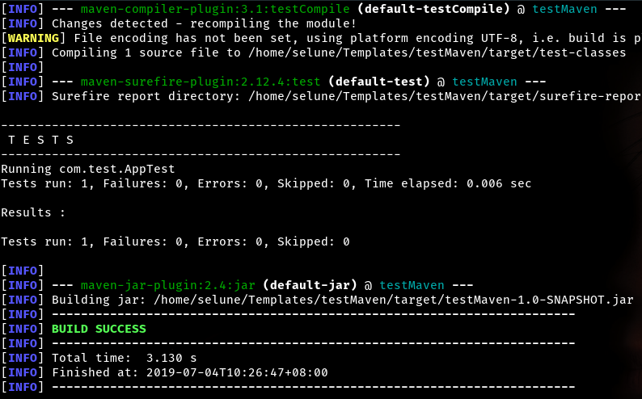
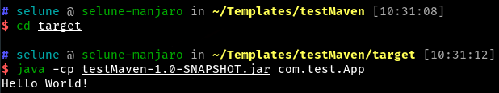
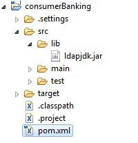

# [Maven](<https://maven.apache.org/pom.html>)

## 什么是 Maven

Maven 翻译为"专家"、"内行"，是 Apache 下的一个纯 Java 开发的开源项目。

基于项目对象模型（缩写：POM）概念，Maven利用一个中央信息片断能管理一个项目的构建、报告和文档等步骤。

Maven 是一个项目管理工具，可以对 Java 项目进行构建、依赖管理。

## Maven 的好处

- **相同的项目结构**

  使用Maven管理的Java 项目都有着相同的项目结构

   	1. 有一个pom.xml 用于维护当前项目都用了哪些jar包
   	2. 所有的java代码都放在 `src/main/java` 下面
   	3. 所有的资源(js, css, html等)都放在 `src/main/resource` 下面
   	4. 所有的测试代码都放在 `src/test/java` 下面

- **统一维护jar包**

  比如说有3个Java 项目，这些项目都不是maven风格。那么这3个项目，就会各自维护一套jar包。 而其中有些jar包是相同的。

  而Maven风格的项目，首先把所有的jar包都放在"[仓库](#Maven-仓库)“ 里，然后哪个项目需要用到这个jar包，只需要给出jar包的名称和版本号就行了。 这样**jar包就实现了共享**


## Maven 安装配置

Maven 是基于Java的工具，使用之前必须安装 Jdk 环境。[安装Java环境](Java安装配置.md)。

### 一、 Maven 下载

[Maven下载地址](https://maven.apache.org/download.cgi)

banben下载对应的包，解压到指定位置，之后设置环境变量。

### 二、 Maven 安装

#### Windows 10

- 解压到`D:\Maven\apache-maven-3.3.9`；
- 右键“计算机”，“属性”，左侧“高级系统设置”，点击“环境变量”，设置环境变量；
- 编辑系统环境变量“Path”，新建，输入`D:\Maven\apache-maven-3.3.9\bin`；
- 点击确定。

#### Linux/MacOS

```bash
# 解压maven包
tar -xvf  apache-maven-3.3.9-bin.tar.gz
# 复制到/opt
sudo cp /apache-maven-3.3.9-bin.tar.gz /opt

# 编辑 /etc/profile 文件 sudo vim /etc/profile，在文件末尾添加如下代码：
export MAVEN_HOME=/usr/local/apache-maven-3.3.9
export PATH=${PATH}:${MAVEN_HOME}/bin

# 保存文件，并运行如下命令使环境变量生效：
source /etc/profile

# 在控制台输入如下命令，如果能看到 Maven 相关版本信息，则说明 Maven 已经安装成功：
mvn -vbanben
```

## Maven POM

POM( Project Object Model，项目对象模型 ) 是 Maven 工程的基本工作单元，是一个XML文件，包含了项目的基本信息，用于描述项目如何构建，声明项目依赖，等等。

执行任务或目标时，Maven 会在当前目录中查找 POM。

它读取 POM，获取所需的配置信息，然后执行目标。

在创建 POM 之前，我们首先需要描述项目组 (groupId), 项目的唯一ID。

```xml
<project xmlns = "http://maven.apache.org/POM/4.0.0"
    xmlns:xsi = "http://www.w3.org/2001/XMLSchema-instance"
    xsi:schemaLocation = "http://maven.apache.org/POM/4.0.0
    http://maven.apache.org/xsd/maven-4.0.0.xsd">

    <!-- 模型版本 -->
    <modelVersion>4.0.0</modelVersion>
    <!-- 公司或者组织的唯一标志，并且配置时生成的路径也是由此生成， 如com.companyname.project-group，maven会将该项目打成的jar包放本地路径：/com/companyname/project-group -->
    <groupId>com.companyname.project-group</groupId>

    <!-- 项目的唯一ID，一个groupId下面可能多个项目，就是靠artifactId来区分的 -->
    <artifactId>project</artifactId>

    <!-- 版本号 -->
    <version>1.0</version>
</project>
```

所有 POM 文件都需要 project 元素和三个必需字段：groupId，artifactId，version。

| 节点         | 描述                                                         |
| ------------ | ------------------------------------------------------------ |
| project      | 工程的根标签                                                 |
| modelVersion | 版本模型，需要设置为4.0                                      |
| groupId      | 这是工程组的标识。它在一个组织或者项目中通常是唯一的。例如，一个银行组织 com.companyname.project-group 拥有所有的和银行相关的项目。 |
| artifactId   | 这是工程的标识。它通常是工程的名称。例如，消费者银行。groupId 和 artifactId 一起定义了 artifact 在仓库中的位置。 |
| version      | 这是工程的版本号。在artifactId区分不同的版本。               |

## Maven 生命周期

| 阶段          | 处理     | 描述                                                     |
| :------------ | :------- | :------------------------------------------------------- |
| 验证 validate | 验证项目 | 验证项目是否正确且所有必须信息是可用的                   |
| 编译 compile  | 执行编译 | 源代码编译在此阶段完成                                   |
| 测试 Test     | 测试     | 使用适当的单元测试框架（例如JUnit）运行测试。            |
| 包装 package  | 打包     | 创建JAR/WAR包如在 pom.xml 中定义提及的包                 |
| 检查 verify   | 检查     | 对集成测试的结果进行检查，以保证质量达标                 |
| 安装 install  | 安装     | 安装打包的项目到本地仓库，以供其他项目使用               |
| 部署 deploy   | 部署     | 拷贝最终的工程包到远程仓库中，以共享给其他开发人员和工程 |

## Maven 构建配置文件

构建配置文件大体上有三种类型:

| 类型                  | 在哪定义                                                     |
| :-------------------- | :----------------------------------------------------------- |
| 项目级（Per Project） | 定义在项目的POM文件pom.xml中                                 |
| 用户级 （Per User）   | 定义在Maven的设置xml文件中 (%USER_HOME%/.m2/settings.xml)    |
| 全局（Global）        | 定义在 Maven 全局的设置 xml 文件中 (%M2_HOME%/conf/settings.xml) |

## Maven 仓库

所谓的仓库就是用于存放项目需要的 Jar 包的。

Maven 采用一个仓库，多个项目的方式，让多个项目共享一个仓库里的相同jar包。

Maven 仓库有三种类型：

- 本地（local）
- 远程（remote）
- 中央（central）

### 本地仓库

Maven 的本地仓库，在安装 Maven 后并不会创建，它是在第一次执行 maven 命令的时候才被创建。

运行 Maven 的时候，Maven 所需要的任何构件都是直接从本地仓库获取的。如果本地仓库没有，它会首先尝试从远程仓库下载构件至本地仓库，然后再使用本地仓库的构件。

默认情况下，不管Linux还是 Windows，每个用户在自己的用户目录下都有一个路径名为 .m2/respository/ 的仓库目录。

Maven 本地仓库默认被创建在 %USER_HOME% 目录下。要修改默认位置，在 %M2_HOME%\conf 目录中的 Maven 的 settings.xml 文件中定义另一个路径（大概在52行左右）。

```xml
<settings xmlns="http://maven.apache.org/SETTINGS/1.0.0"
          xmlns:xsi="http://www.w3.org/2001/XMLSchema-instance"
          xsi:schemaLocation="http://maven.apache.org/SETTINGS/1.0.0     
                              http://maven.apache.org/xsd/settings-1.0.0.xsd">       
    <localRepository>D:/MyLocalRepository</localRepository>
</settings>
```

当你运行 Maven 命令，Maven 将下载依赖的文件到你指定的路径中。

### 中央仓库

Maven 中央仓库是由 Maven 社区提供的仓库，其中包含了大量常用的库。

中央仓库包含了绝大多数流行的开源Java构件，以及源码、作者信息、SCM、信息、许可证信息等。一般来说，简单的Java项目依赖的构件都可以在这里下载到。

中央仓库的关键概念：

- 这个仓库由 Maven 社区管理。
- 不需要配置。
- 需要通过网络才能访问。

要浏览中央仓库的内容，maven 社区提供了一个 URL：<http://search.maven.org/#browse>。使用这个仓库，开发人员可以搜索所有可以获取的代码库。

### 远程仓库

如果 Maven 在中央仓库中也找不到依赖的文件，它会停止构建过程并输出错误信息到控制台。为避免这种情况，Maven 提供了远程仓库的概念，它是开发人员自己定制仓库，包含了所需要的代码库或者其他工程中用到的 jar 文件。

### Maven 依赖搜索顺序

当我们执行 Maven 构建命令时，Maven 开始按照以下顺序查找依赖的库：

- **步骤 1** － 在本地仓库中搜索，如果找不到，执行步骤 2，如果找到了则执行其他操作。
- **步骤 2** － 在中央仓库中搜索，如果找不到，并且有一个或多个远程仓库已经设置，则执行步骤 4，如果找到了则下载到本地仓库中以备将来引用。
- **步骤 3** － 如果远程仓库没有被设置，Maven 将简单的停滞处理并抛出错误（无法找到依赖的文件）。
- **步骤 4** － 在一个或多个远程仓库中搜索依赖的文件，如果找到则下载到本地仓库以备将来引用，否则 Maven 将停止处理并抛出错误（无法找到依赖的文件）。

### 默认下载路径

Maven 会默认从 Maven 官方提供的服务器下载 Jar 包。 
而官方服务器在国外，因为大家都知道的原因，网速很慢，而且容易卡断。 为了便于快速下载相关jar包，可以使用国内 Maven 阿里云的下载地址：[使用阿里云下载路径](http://how2j.cn/k/maven/maven-repositories/1330.html#step5570)

### 替换阿里云源

打开 `settings.xml`。

修改在mirrors下新加一个阿里云的镜像地址（大概在160-165行）：

```xml
<mirror>
	<id>alimaven</id>
    <mirrorOf>central</mirrorOf>
    <name>aliyun maven</name>
    <url>http://maven.aliyun.com/nexus/content/repositories/central/</url>
</mirror>
```

## Maven 创建 Maven 项目

通过Maven 命令行构建一个可以运行的Maven项目。

### 一、 创建Maven

在一个目录下创建一个文件夹：`~/Templates`；

```shell
cd Templates
mvn archetype:generate -DgroupId=com.test -DartifactId=testMaven -DarchetypeArtifactId=maven-archetype-quickstart -DinteractiveMode=false
```

**archetype:generate** 表示创建个项目
**-DgroupId** 项目包名: com.test
**-DartifactId** 项目名称: testMaven
**-DarchetypeArtifactId** 项目类型: maven-archetype-quickstart
**-DinteractiveMode:false** 表示前面参数都给了，就不用一个一个地输入了

运行成功会看到绿色的 <font color="green">BUILD SUCCESS</font>


### 二、 运行package

可以看到在Templates文件夹下多了一个testMaven 文件夹，这个就是项目的文件夹

```shell
cd testMaven
mvn package
```

最后会看到一个绿色的 <font color="green">BUILD SUCCESS</font>。



package做了很多事情，编译，测试，打包，最后生成了一个**testMaven-1.0-SNAPSHOT.jar**包，里面放了APP这个类。

### 三、 执行Jar 包

可以看到项目包内，多了一个target文件夹

```shell
cd target
java -cp testMaven-1.0-SNAPSHOT.jar com.test.App
```

直接输出 `Hello World！`



## Maven 引入外部依赖

pom.xml 的 dependencies 列表列出了我们的项目需要构建的所有外部依赖项。

要添加依赖项，我们一般是先在 src 文件夹下添加 lib 文件夹，然后将你工程需要的 jar 文件复制到 lib 文件夹下。我们使用的是 ldapjdk.jar ，它是为 LDAP 操作的一个帮助库：



然后添加以下依赖到 pom.xml 文件中：

```xml
<dependencies>
    <!-- 在这里添加你的依赖 -->
    <dependency>
        <groupId>ldapjdk</groupId>  <!-- 库名称，也可以自定义 -->
        <artifactId>ldapjdk</artifactId>    <!--库名称，也可以自定义-->
        <version>1.0</version> <!--版本号-->
        <scope>system</scope> <!--作用域-->
        <systemPath>${basedir}\src\lib\ldapjdk.jar</systemPath> <!--项目根目录下的lib文件夹下-->
    </dependency> 
</dependencies>
```

